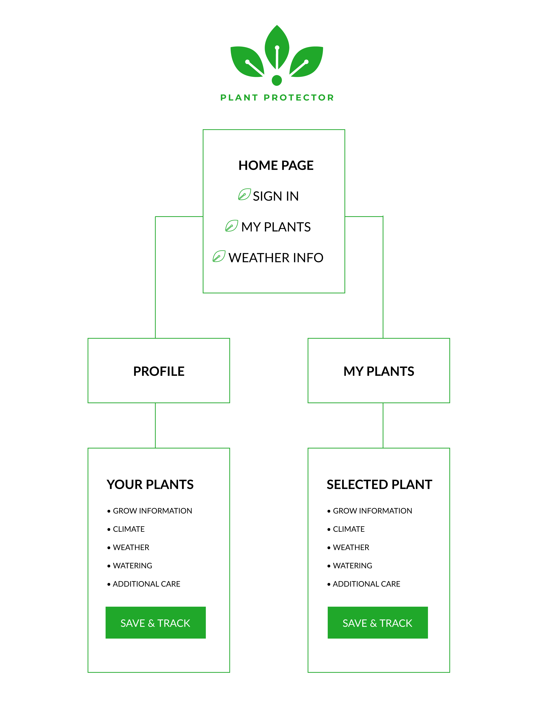
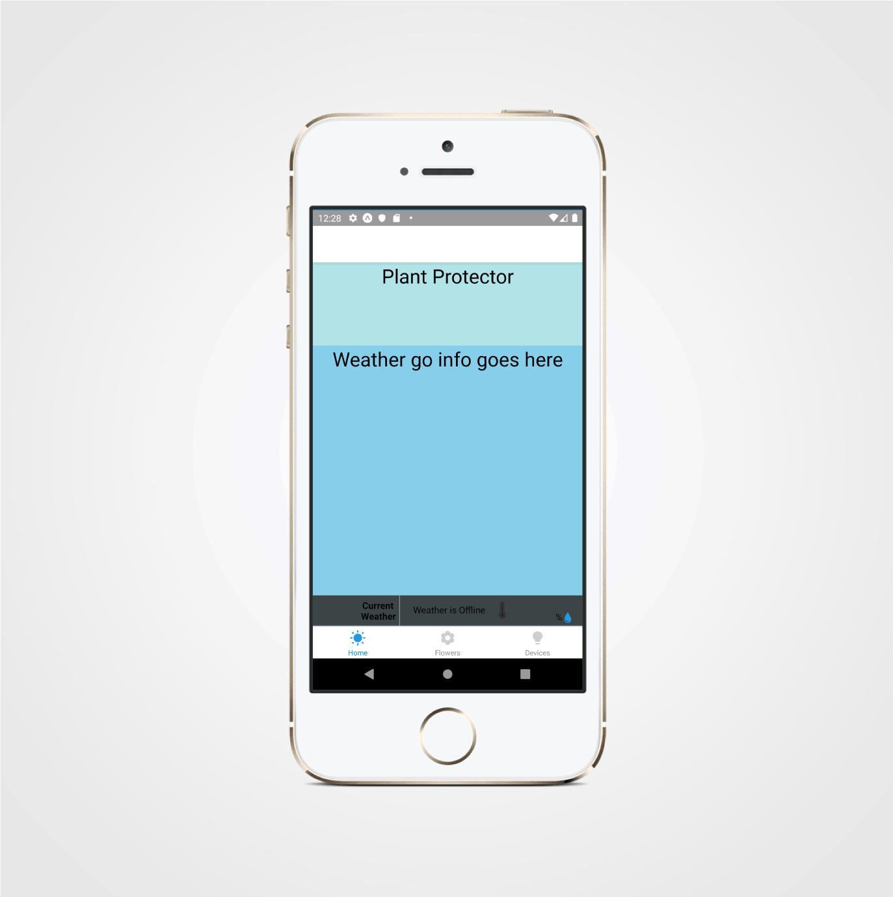
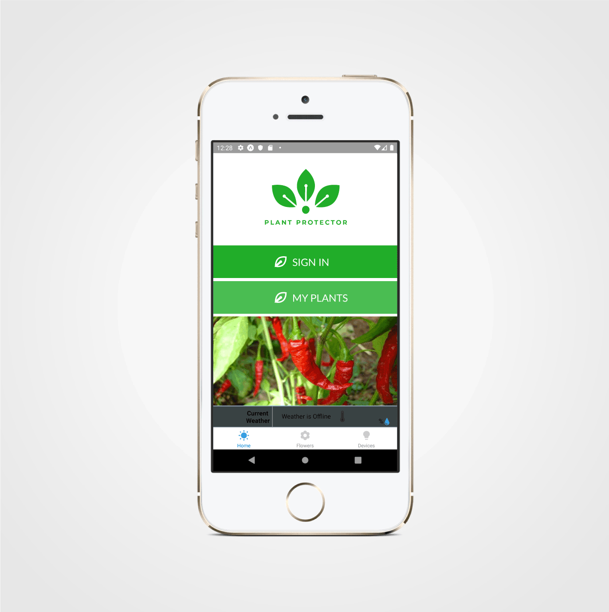
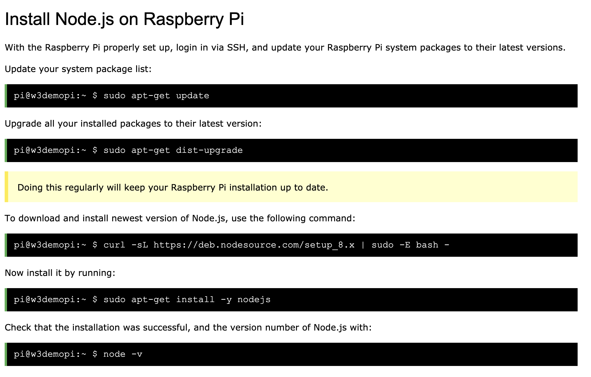

# Plant-Protector
Mobile App to ease the workload while gardening. Accomplished by using ESP8266 controllers and Web data to inform user to take action in the garden.

This App tracks the growing cycle of your peppers, and provides information on methods to produce the best harvest.

## Installation
## For Mobile
```bash
Clone Repository
```

```bash
npm install
```
```bash
expo start
```
## For Web
```bash
Clone Repository
```
```bash
npm install
```
```bash
expo start --web
```

## Github Repository

https://github.com/thegroupthatworkz/Plant-Protector.git

## Tools Used

- Javascript
- React
- HTML
- CSS
- Expo CLI
- ESP8266 controllers
- NodeJS
- Firebase


### Wireframes and Planning




## Initial Design 

UX/UI Iterations 





### Raspberry Pi for Styling



